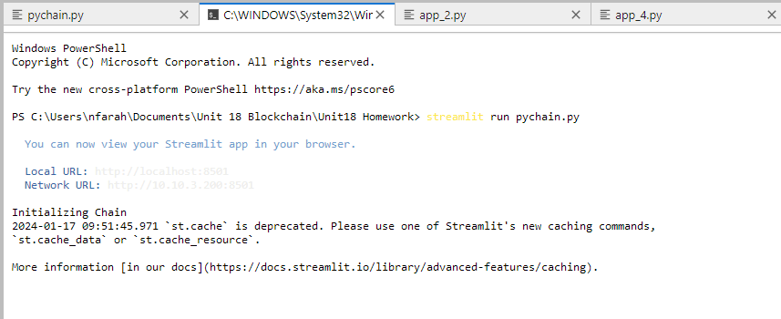
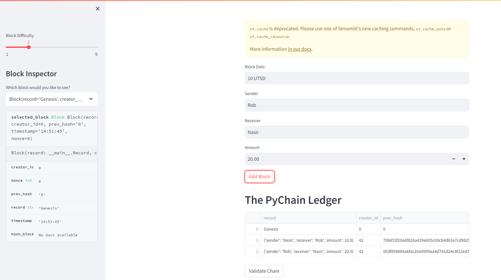
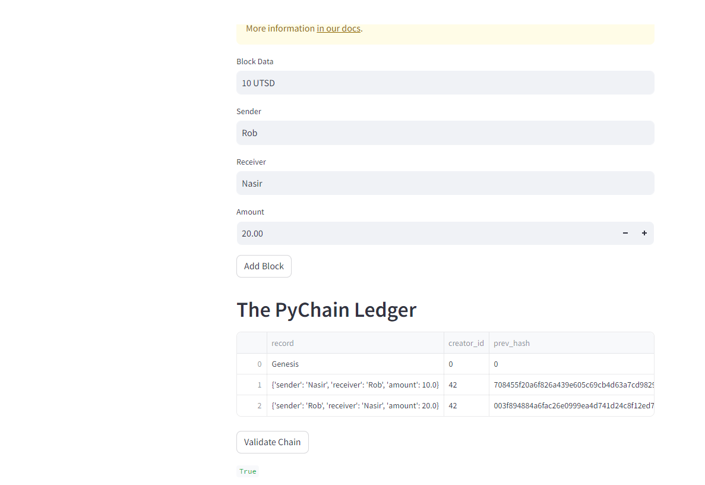

## Unit-18-Homework
1- the following screanshot shows; using the  terminal to run the Streamlit application by using "streamlit run pychain.py"

2- The following screenshot shows the Streamlit application page

Test byr send vs receive

To validate

